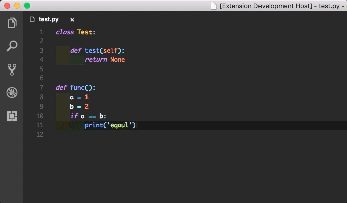

# Change Log

## 0.3.0

 - No ident for empty line.

## 0.1.5

 - Optimized for speed.
 - Fixed for pasting into a selected region.

## 0.1.4

 - Bug fixes.
 - Enables pasting for a single line.

## 0.1.2

 - When a line ends with `(`, `[` or `{`, the next line should be indented.

## 0.1.1

 - Fix bugs.

## 0.0.3

  

 - The command is changed from `pyPasteIndent.pasteAndIndent` to `pyPasteIndent.pasteIndent`.
 - Directly rewrite the clipboard content so that no "content flash" would appear.
 - In order to access the clipboard API, update your vscode. This version is tested on vscode 1.30.1.

## 0.0.2

  