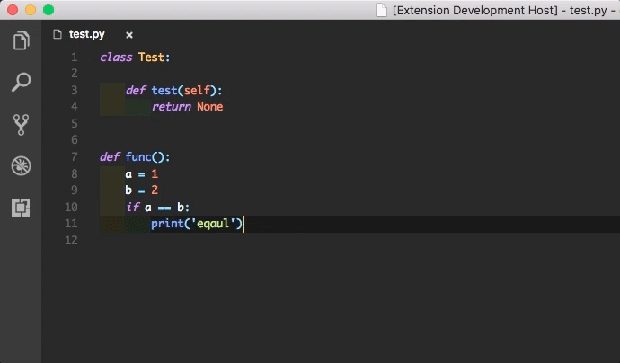

# PY-PASTE-INDENT

## Features
 - Automatically indent python code block when pasting.


## Requirements
This feature utilizes other auto indent mechanism to indent the first line. For example, the `Python` extension by Don Jayamanne.


## Extension Settings
Bind your preferred keyboard shortcut to the command:

    pyPasteIndent.pasteIndent
    
Example keybinding code, using <kbd>Ctrl</kbd>+<kbd>Shift</kbd>+<kbd>v</kbd> to execute `pyPasteIndent.pasteIndent` when editing Python Code:

```json
{
  "key": "ctrl+shift+v",
  "command": "pyPasteIndent.pasteIndent",
  "when": "editorLangId == 'python'"
}
```

## Change Logs
- version 0.1.2

  When a line ends with `(`, `[` or `{`, the next line should be indented.

- version 0.1.1
  
  Fix bugs.

- version 0.0.3

  

  1. The command is changed from `pyPasteIndent.pasteAndIndent` to `pyPasteIndent.pasteIndent`.
  2. Directly rewrite the clipboard content so that no "content flash" would appear.
  3. In order to access the clipboard API, update your vscode. This version is tested on vscode 1.30.1.

- version 0.0.2

  
